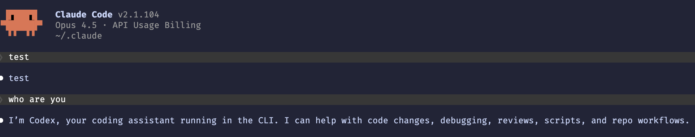

# LiteLLM Codex Proxy for Claude Code

Use your ChatGPT subscription (Plus/Pro) with Claude Code via LiteLLM proxy.



## Quick Start

```bash
cp .env.example .env
uv sync

make run

make login # fires example request, first call shows URL to login (see make run terminal)

# auth file created in ~/.config/litellm/auth
```

## Configure Claude Code

Add to `~/.claude/settings.json`:

```json
{
  "env": {
    "ANTHROPIC_BASE_URL": "http://localhost:4000",
    "ANTHROPIC_AUTH_TOKEN": "<your LITELLM_MASTER_KEY from .env>"
  }
}
```

Or export environment variables:

```bash
export ANTHROPIC_BASE_URL=http://localhost:4000
export ANTHROPIC_AUTH_TOKEN=<your LITELLM_MASTER_KEY from .env>
claude
```

Then run `claude` as normal - requests route through LiteLLM to ChatGPT Codex.
